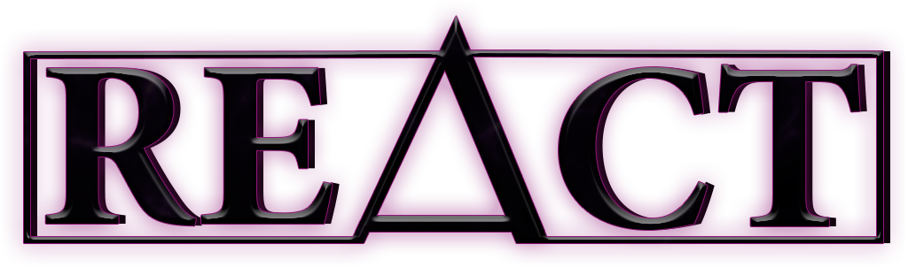

# 

<i>
Relative Energies Automated Calculation inTerface
</i>

# REACT
REACT is developed by PhD Geir Villy Isaksen and MSc Bente Sirin Barge. The main vision behind is to deliver a compact, 
intuitive & efficient software for energy calculations taylor made for enzyme catalysed reactions.  