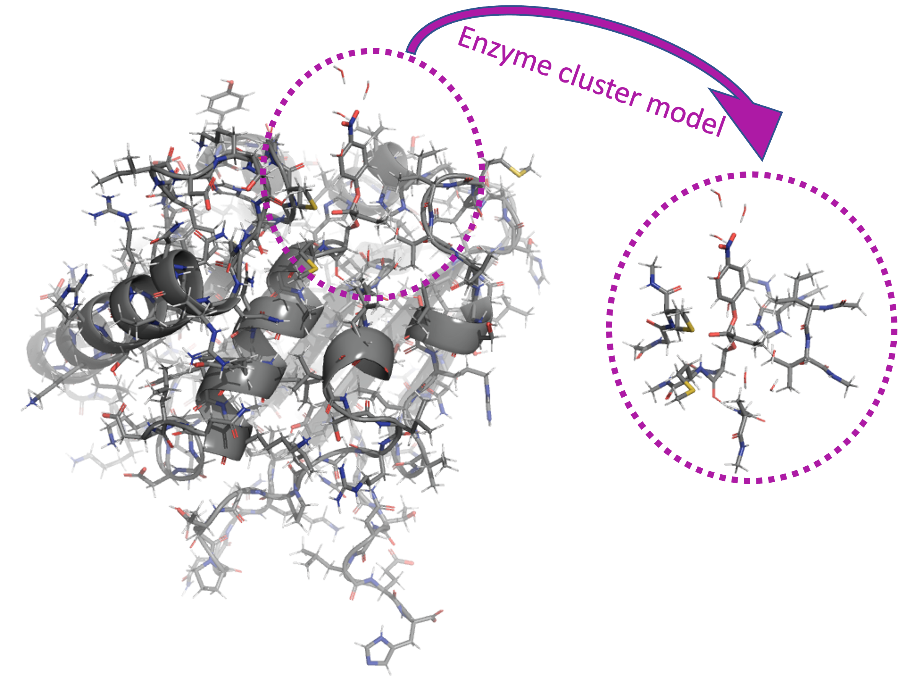
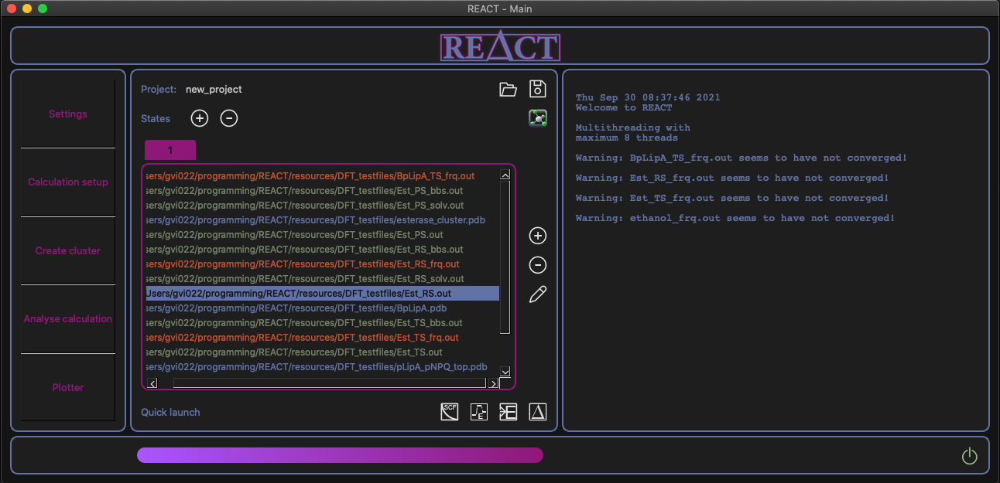
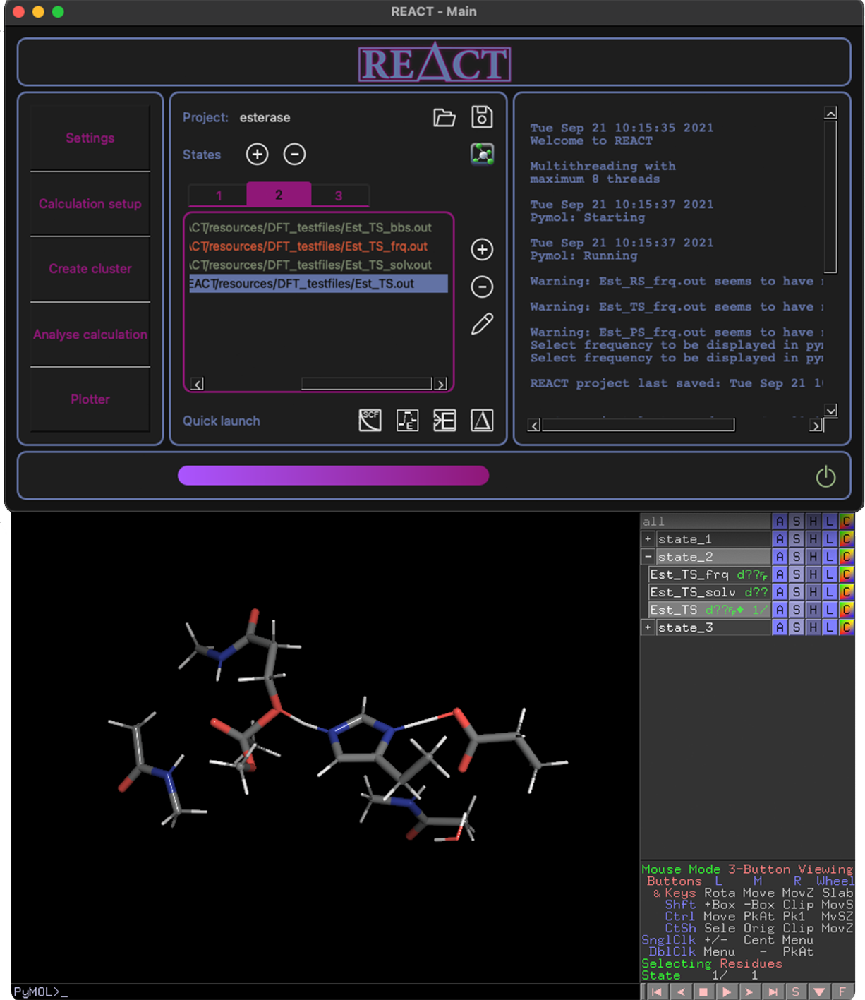
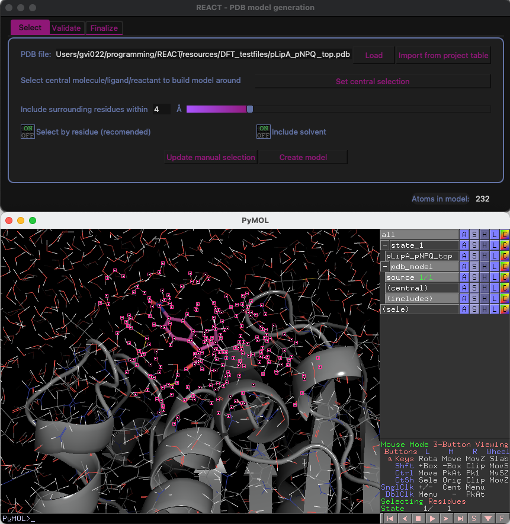
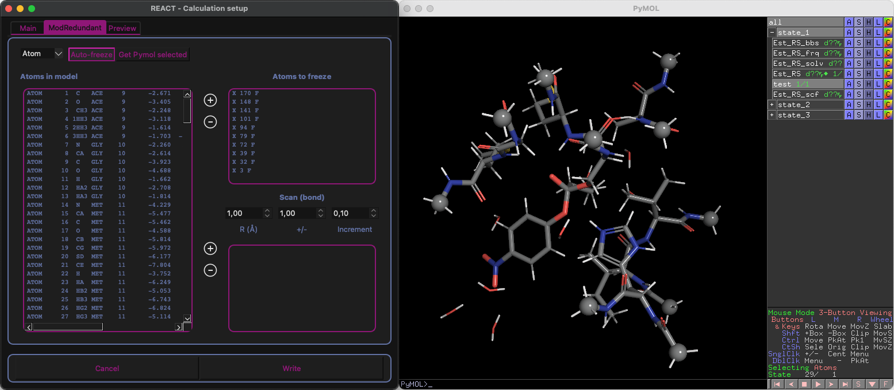
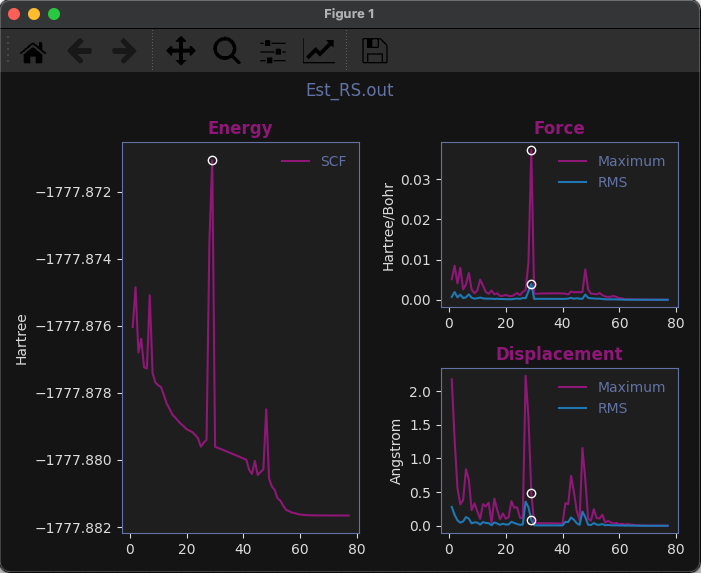
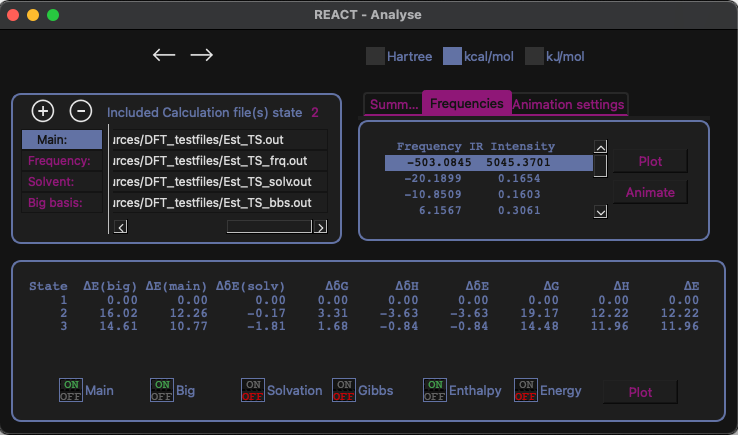
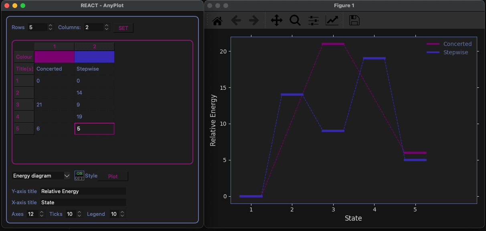

<!-- # 

<i>
Relative Energies Automated Calculation inTerface
</i>

 -->

# REACT - making computational chemistry easy 
REACT is developed by [PhD Geir Villy Isaksen](about.md/#PhD-Geir-Villy-Isaksen) and [MSc Bente Sirin Barge](about.md/#MSc-Bente-Sirin-Barge) 
from UiT The Arctic University of Norway. The main vision behind is to deliver a compact, intuitive & efficient software 
for energy calculations taylor made for enzyme catalysed reactions.

## What it does
<ul>
<li> Automatic calculation of relative energies and easy inclusion of typical correctional terms:
    <ul>
    <li> Solvation </li>
    <li> Big basis </li>
    <li> Frequencies / thermal corrections </li>
    </ul>
</li>
<li> Generation of enzyme cluster models </li>
<li> Store all related project files with respect to where they belong in a reaction pathway (states) </li>
<li> Handling of several filetypes (pdb, xyz, com, out, inp) in a filetype-independent way </li>
<li> Plotting functionalities to visualize:
    <ul>
    <li> Energy diagrams </li>
    <li> SCF convergence </li>
    <li> Frequencies / IR spectrum </li>
    </ul>
</li>
<li> Pymol connectivity for molecular visualization of all project files 
    <ul>
    <li> Frequency animation </li>
    <li> SCF geometry optimization visualisation </li>
    <li> Enzyme cluster model generation  </li>
    </ul>
</li>
<li> Easy setup of new input files for DFT/QM calculations </li>

</ul>

## What it does not
<ul>
<li> The actual QM/DFT calculations. </li>
</ul>
There are several excellent software packages on the market for doing hard-core quantum mechanics (QM) and density
functional theory (DFT) calculations. Our goal has been to design an efficient project tool that automates many of the 
tedious tasks required to both set up and post-analyse QM/DFT calculations. 

## Supported DFT / QM software packages
Currently, we have only implemented input/output support for [Gaussian](https://gaussian.com). REACT is however designed
with the purpose of easy support implementation for other QM/DFT engines. 

## Screenshots
### REACT main window

### All project files and states synced to Pymol

### Creating run-ready cluster models

### Automatic detection atoms to freeze (cluster)

### Familiar convergence plots

### Efficient analysis tool

### Energy diagram custom plotting tool 
